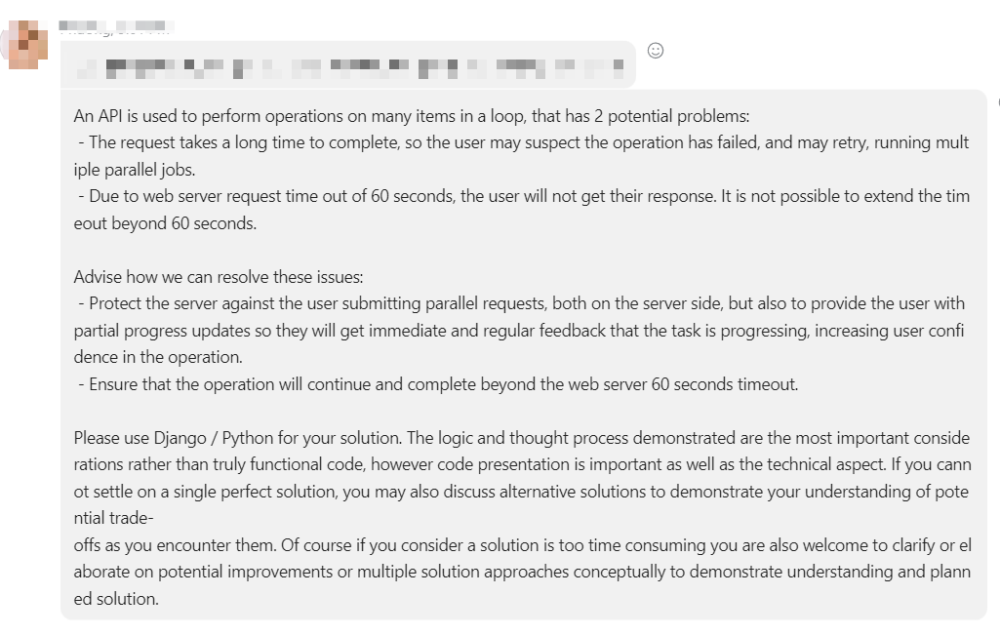

# Build a sample API

## Requirements


## How to use
<a href="https://www.loom.com/share/0054ec62aec8462dbb2f7ee22c12e1b4">
    <p>Demo: Django API with client long-polling request to update status - Watch Video</p>
    
</a>

### Demo system
URL: https://savvy-demo-api-6nkxh.ondigitalocean.app/  
Username: demo  
Password: demo@123

## How to run
1. Clone this repository and go to the project folder
2. Create `.env` file with content like `.env.example`, `.env.docker` file with content like `.env.docker.example`, `.env.postgresql` file with content like `.env.postgresql.example`
```bash
cp .env.example .env
cp .env.docker.example .env.docker
cp .env.postgresql.example .env.postgresql
```
   
3. Build docker image and run docker container
```bash
docker-compose build
docker-compose up
```
4. Access to the `web` container and run `python manage.py migrate` to migrate database
5. Access to the `web` container and create a new user with command `python manage.py createsuperuser`
6. Open `http://localhost:8000` and login with the user you just created

## How this project is developed
* Assume that each item in loop need 2 seconds to process by create function `long_run_process` in the `Item` model
* Handle the API by using `Celery` to process the task in background and use long-polling request to update the status of the request. I also write a decorator to protect server against users submitting parallel requests. See the function `long_running_task_with_tuning` in `sample.views.api` for more detail
* Use a model - `Task` to store the status of request. The status will be updated by the `Celery` task. 
